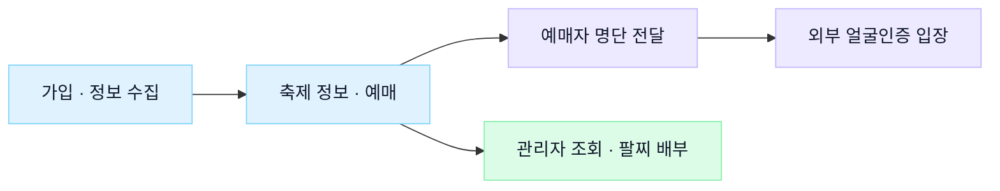

  

  <b>현장의 요구를 구체화하고, 구현과 검증으로 서비스에 반영합니다.</b> 
  사용자와 운영자의 업무를 이해하고, AI를 활용해 만들고, 실제 사용 흐름에서 확인합니다.

  <a href="mailto:pjuhee23@dankook.ac.kr">Email</a> &nbsp;·&nbsp;
  <a href="https://github.com/juhee0223/juhee0223/blob/main/Resume_JuheePark.md">이력서</a>

 

## Selected Projects

| 🎟️ 서비스 개발·운영 | 🧪 AI 응답 개선 | 🔎 시스템 관측·검증 |
| :--- | :--- | :--- |
| [**단짠**](#danzzan) | [**Conquer Health**](#conquer-health) | [**OLLY**](#olly) |
| 요구사항을 가입·예매·현장 업무로 연결 | 평가 기준을 응답 규칙으로 구체화 | 요청 단위로 지연·오류 원인을 추적 |

 

## 01. 단짠
### 축제 예매와 현장 입장을 연결한 서비스 개발·운영

`2025.12 – 진행 중` &nbsp; `팀 프로젝트` &nbsp; `서비스 운영`

축제 정보 탐색부터 예매, 현장 입장과 팔찌 배부까지 연결하는 대학 축제 웹앱입니다. 총학생회·학교·협력사와 요구를 조율하고, AI 도구를 활용한 화면 구현과 사용자 검증, 운영 장애 복구에 참여했습니다.

> **팀 운영 성과** · 약 열흘 만에 가입자 약 **6,000명**, 티켓 **3,500장 1분 매진**. 얼굴인증 입장과 관리자 화면을 활용한 현장 배부를 운영했습니다.

**제가 맡은 문제와 해결**

| 문제 | 판단과 실행 |
| :--- | :--- |
| 같은 네이버 ID라도 날짜별 입장 권한이 다름 | 협력사에 날짜별 처리 기준을 질문하고, 수정분과 전체 명단 중 전달 범위를 확인해 전체 명단 대조 방식에 합의 |
| 외부 입장 연계에 필요한 정보를 가입 과정에서 수집해야 함 | 팀원과 단계 추가 여부를 비교해 기존 3단계를 유지. 마지막 단계에 안내·입력란을 배치하고 React/TypeScript 화면과 필수 동의 판정을 수정 |
| 베타테스트에서 SMS 인증 방식에 혼란이 생김 | 안내를 간결하게 고치고 SMS 딥링크로 문자 앱을 연결. 네이버 이메일 형식 입력은 협력사와 정제 담당을 별도로 합의 |

<b>구현 근거 · 가입 흐름과 동의 판정</b>

 

- **설계 판단:** 입력 단계를 늘리는 대신 기존 마지막 단계에 네이버 ID 수집을 포함했습니다. 초기 흐름은 팀원과 공동으로 논의했습니다.
- **코드 변경:** 필수 동의 여부를 고정된 배열 인덱스로 확인하던 방식을 각 항목의 `required` 속성과 체크 여부에 따라 판정하도록 수정했습니다.
- **사용자 확인:** 서비스를 처음 사용하는 학생의 베타테스트에서 인증 방법의 혼란을 확인하고 안내와 문자 앱 연결을 개선했습니다.
- **남은 입력 문제:** 안내만으로 네이버 이메일 형식의 입력이 사라지지는 않았습니다. 개발팀의 정제 방안을 제안하고, 협의 후 네이버페이가 정제를 맡기로 했습니다.

[가입·동의 판정 변경 PR #65](https://github.com/DKU-Dan-Zzan/Danzzan-FE/pull/65)

PR은 입력 안내와 동의 판정 변경의 근거입니다. 최초 가입 구조와 SMS 연결의 전체 변경 이력을 의미하지는 않습니다.

<b>운영 문제 해결 · 번역 누락과 반복 호출 복구</b>

 

**현상:** 영어 화면에서 일부 콘텐츠가 한국어로 남고, 새 공지의 자동 번역도 채워지지 않았습니다. 최초 구현 담당자와 협의한 뒤 복구를 맡았습니다.

| 단계 | 수행 내용 |
| :--- | :--- |
| 원인 확인 | 클라우드 서버의 Docker 로그를 확보하고 AI와 분석. MySQL 영문 컬럼 길이 초과로 회차 전체 저장이 롤백되어 같은 데이터를 반복 번역하는 구조를 확인 |
| 수정 | 영문 컬럼 확장, 저장 트랜잭션을 행별로 분리하는 수정본 배포, 번역 재개 후 공백 데이터 정리 |
| 검증 | 실제 번역 대상 조건으로 미번역 데이터 **0건** 확인. 신규 공지의 자동 번역·저장·영어 화면 표시까지 확인 |

저는 장애 발견, 로그 확보, AI를 활용한 분석·수정, 배포 후 확인을 맡았습니다. 번역 기능의 최초 구현은 팀원의 작업입니다.

[번역 복구 PR #70](https://github.com/DKU-Dan-Zzan/Danzzan-BE/pull/70) · [복구 확인 기록](https://github.com/DKU-Dan-Zzan/Danzzan-BE/pull/70#issuecomment-5473781220)

**사례에 사용한 기술** &nbsp; `React` `TypeScript` `Spring Boot` `MySQL` `Docker`

[프론트엔드 저장소 ↗](https://github.com/DKU-Dan-Zzan/Danzzan-FE) &nbsp;·&nbsp; [백엔드 저장소 ↗](https://github.com/DKU-Dan-Zzan/Danzzan-BE)

 

---

## 02. Conquer Health
### 평가 기준을 응답 규칙으로 옮긴 의료 AI 개선

`2026.08` &nbsp; `팀 해커톤` &nbsp; `20시간`

루닛의 의료 특화 모델 **L2-preview**를 활용해 건강 상담 응답을 개선했습니다. 저는 개발 중 비교 결과를 근거로 집중할 방향을 제안하고, **HealthBench 평가 기준 분석과 팀의 하네스 공동 개선**에 참여했습니다.

> **팀 평가 성과** · 정식 평가 3라운드 평균 **46.51점**, 평가 참여 **14팀 중 1위** · 🏆 **벤치마크상**

**평가 관점을 구현으로 연결한 방식**

| 개선 관점 | 응답 규칙으로 구체화 |
| :--- | :--- |
| 답변의 누락 줄이기 | 질문에 포함된 모든 요구를 다루도록 지시 |
| 위험 신호 전달 | 주의해야 할 위험 신호를 답변에 포함하도록 지시 |
| 맥락에 맞는 답변 | 답을 바꿀 핵심 정보가 부족하면 질문하되, 제공할 수 있는 설명을 먼저 제시 |

<b>구현 근거 · 기존 생성 요청에 응답 규칙 적용</b>

 

**접근 변경:** 검색 도구 중심 접근의 점수가 정체된 상황에서, 당시 대시보드 최고점 구현에 남은 시간을 집중하자고 제안했습니다. 이후 팀과 평가 기준을 응답 행동 규칙으로 구체화했습니다.

**구현 구조:** `ANSWER_INSTRUCTION`을 `_with_answer_instruction`에서 마지막 사용자 메시지에 덧붙여 기존 생성 요청에 반영했습니다. 이 규칙을 적용하기 위한 별도 LLM 호출은 추가하지 않았습니다.

**결과 해석:** 정식 평가 점수는 팀 전체 구현의 결과입니다. 개별 규칙 하나의 독립적인 점수 상승 효과나 실제 의료 현장에서의 성능을 의미하지 않습니다.

[팀의 응답 규칙 변경 커밋](https://github.com/Hackathon-AIM/health-conquer-submission/commit/52e79c8f5e2cb080466f9a299ee05b0afd9d0f69)

**사례에 사용한 기술** &nbsp; `Python` `LLM` `Prompt / Harness` `HealthBench`

[프로젝트 저장소 ↗](https://github.com/Hackathon-AIM/health-conquer-submission)

 

---

## 03. OLLY
### 느린 LLM 요청의 원인을 단계별로 확인하는 관측성 MVP

`2026.05 – 2026.06` &nbsp; `4인 팀` &nbsp; `로컬 MVP`

전체 응답 시간만으로 구분하기 어려운 검색·모델 호출·오류를 요청 단위로 추적하는 프로젝트입니다. 저는 **문제 정의, 로컬 SLM 선택과 개발 범위 판단, 검증 시나리오 설계**를 맡았으며 AI 에이전트를 활용했습니다.

> **검증 범위** · 정상·검색 지연·모델 지연·토큰 증가·오류, **5개 시나리오 × 10회**

**관측 흐름** &nbsp; Chat UI → `request_id / trace_id` → Dashboard · Jaeger → 오류 알림

| 확인하고 싶은 문제 | 관측 방법 |
| :--- | :--- |
| 검색과 모델 호출 중 어느 단계가 느린가 | 지연을 주입한 단계의 span과 소요 시간을 비교 |
| 토큰 증가가 요청에 어떻게 나타나는가 | 요청별 토큰·비용 지표를 확인 |
| 실패한 요청을 끝까지 추적할 수 있는가 | 오류 상태를 유지한 채 대시보드·Jaeger 추적과 Discord 알림을 연결 |

<b>설계와 검증 · 반복 가능한 실험 범위 설정</b>

 

- **문제 정의:** 총 응답 시간만 보는 대신 한 요청 안의 실행 단계를 나누어 병목을 확인하도록 했습니다.
- **범위 선택:** 외부 API 비용과 호출 제한의 영향을 줄이기 위해 로컬 SLM으로 실험 범위를 정했습니다.
- **검증 설계:** 정상 흐름과 단계별 지연·토큰 증가·오류를 구분해 반복 실행하도록 설계했습니다.
- **팀의 확인 결과:** 시나리오별 span·지표의 차이를 관찰하고, 오류 요청의 추적과 Discord 알림 연결을 확인했습니다.

이 결과는 로컬 MVP의 관측 흐름 검증입니다. 운영 환경의 성능 개선율을 측정한 결과는 아닙니다.

**프로젝트 기술** &nbsp; `FastAPI` `OpenTelemetry` `Prometheus` `Jaeger` `Grafana` `Docker` `Kubernetes`

[프로젝트 저장소 ↗](https://github.com/lee-y-ch/olly)

 

---

## More Projects & Research

<b>개인 프로젝트 · 해커톤 · 연구 경험 더 보기</b>

 

| 프로젝트 | 탐구한 문제 |
| :--- | :--- |
| [**SketchToSpec**](https://github.com/juhee0223/DEEPLEARNING_AI_AGENT) · 개인 | 손그림 UI와 기능 설명을 요구사항 명세·화면 흐름으로 변환하는 멀티모달 에이전트 |
| [**Sun(善)-Date**](https://github.com/day-e0n/sun_date) | 봉사활동을 매개로 한 소셜 네트워킹 · EASYTHON 2025 우수상 |
| [**FTL Simulator / GameGC**](https://github.com/day-e0n/ssp_team_project) | GC 정책에 따른 지연과 점진적 회수 패턴 비교 |
| [**고객 지원 등급 분류**](https://github.com/juhee0223/DACON-Customer-Support-Classification) · 개인 | 고객 데이터의 특성 설계와 분류 모델 비교 |
| [**AI Bird Repeller**](https://github.com/JustYOLO/Getout_Bird) | 조류 인식과 소리 재생을 연결한 퇴치 시스템 · KHUTHON 2025 우수상 |
| **RocksDB Compaction Analyzer** | Compaction 정책별 성능 측정·분석·시각화 · KCC 2025 논문 제1저자 발표 |

 

  <a href="mailto:pjuhee23@dankook.ac.kr">pjuhee23@dankook.ac.kr</a> 
  박주희 · Software Engineer

